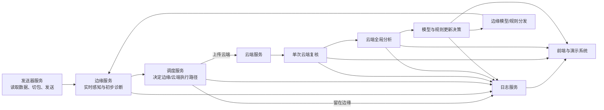
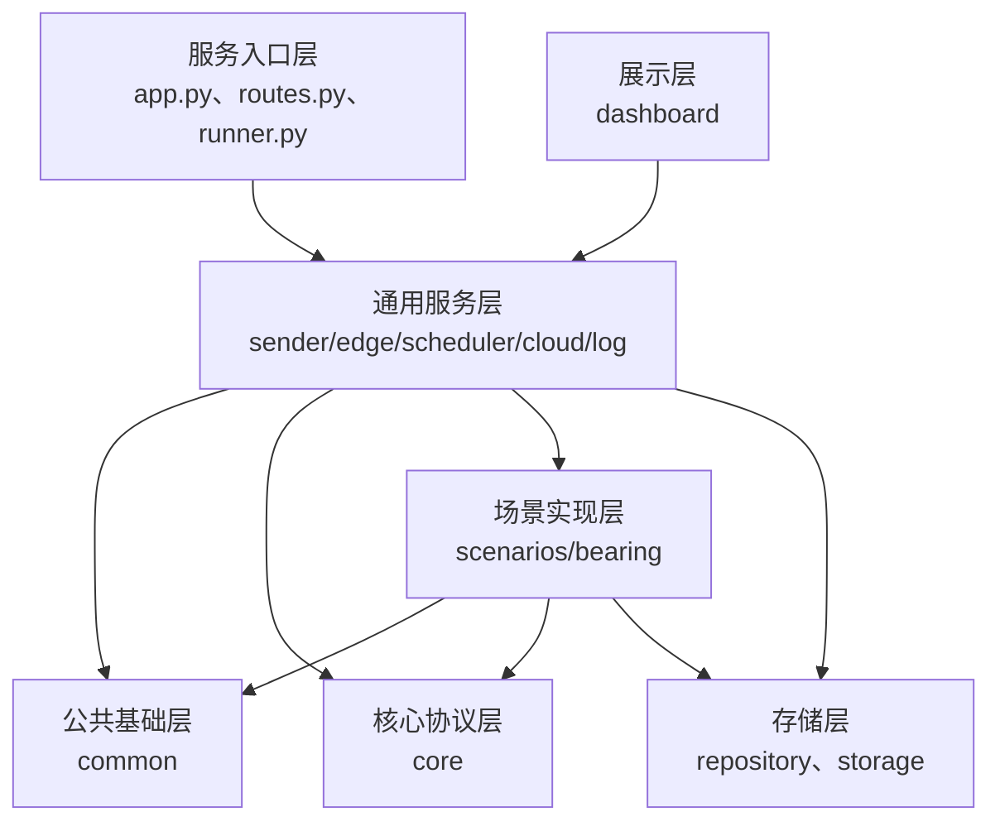
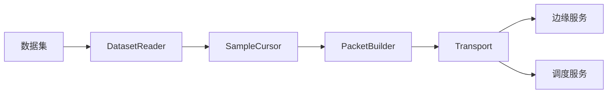
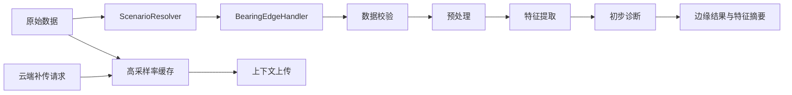
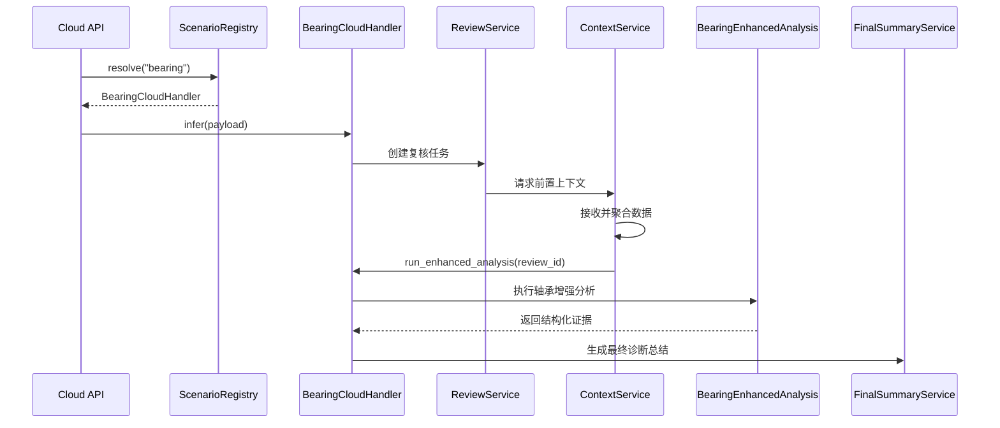
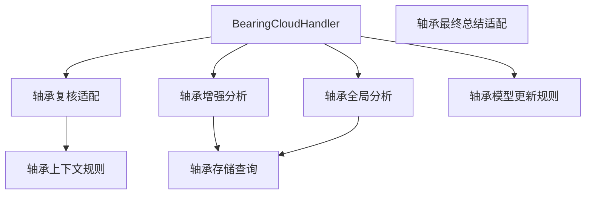
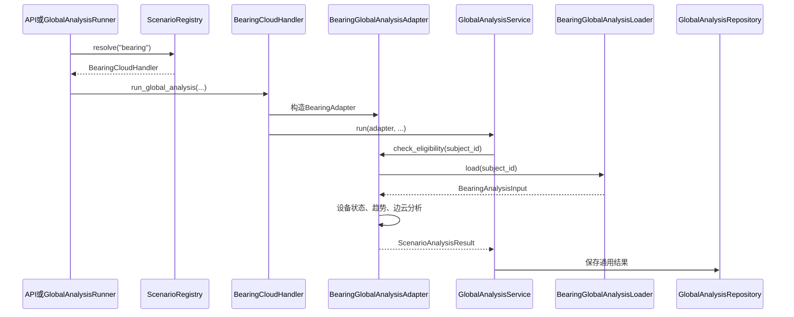
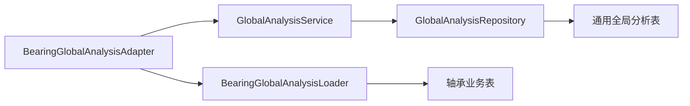
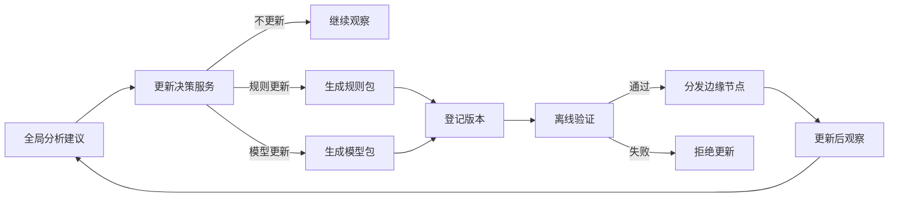
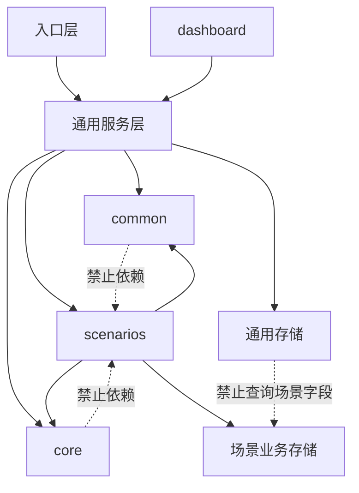

# 云边协同智能维护项目最终目录结构设计

> 历史设计文档：本文描述的是早期目标架构，不代表当前仓库目录。当前启动入口为
> `start_project.ps1`；旧版 `start_all.py`、Consistency 和 Log 独立服务已移除。

> 本文描述的是**可迁移化改造、轴承场景封装、云端全局分析、模型更新闭环和前端展示全部完成后**的最终项目结构。  
> 文档不区分“当前已有”和“计划新增”，目录中的内容均表示最终项目应具有的组织形式。

---

# 1. 项目总体架构



项目最终分为六个主要层次：

1. **基础公共层**：配置、日志、ID、公共协议。
2. **通用核心层**：场景注册、全局分析协议、模型更新协议。
3. **通用服务层**：发送器、边缘、调度、云端、日志、前端。
4. **场景实现层**：轴承场景的边缘处理、云端增强分析、全局分析。
5. **存储与运行层**：SQLite、模型包、原始上下文、分析窗口。
6. **测试与文档层**：单元测试、集成测试、端到端测试和技术文档。

---

# 2. 最终完整目录

```text
cloud_edge_project/
│
├── pyproject.toml
├── requirements.txt
├── requirements-dev.txt
├── README.md
├── start_all.py
│
├── configs/
│   ├── common.yaml
│   ├── local.yaml
│   ├── cloud.yaml
│   ├── edge.yaml
│   ├── scheduler.yaml
│   ├── logging.yaml
│   ├── global_analysis.yaml
│   ├── model_update.yaml
│   └── scenarios/
│       └── bearing.yaml
│
├── common/
│   ├── __init__.py
│   ├── config.py
│   ├── logger.py
│   ├── time_utils.py
│   ├── id_utils.py
│   ├── json_utils.py
│   ├── hashing.py
│   └── schemas.py
│
├── core/
│   ├── __init__.py
│   │
│   ├── scenario/
│   │   ├── __init__.py
│   │   ├── protocol.py
│   │   ├── registry.py
│   │   ├── context.py
│   │   └── errors.py
│   │
│   ├── global_analysis/
│   │   ├── __init__.py
│   │   ├── protocol.py
│   │   ├── contracts.py
│   │   └── errors.py
│   │
│   ├── model_update/
│   │   ├── __init__.py
│   │   ├── protocol.py
│   │   ├── contracts.py
│   │   └── errors.py
│   │
│   └── events/
│       ├── __init__.py
│       ├── contracts.py
│       ├── dispatcher.py
│       └── outbox.py
│
├── sender_service/
│   ├── __init__.py
│   ├── app.py
│   ├── config.py
│   ├── routes.py
│   ├── service.py
│   │
│   ├── dataset/
│   │   ├── __init__.py
│   │   ├── reader.py
│   │   ├── mat_reader.py
│   │   ├── dataset_adapter.py
│   │   └── sample_cursor.py
│   │
│   ├── packet/
│   │   ├── __init__.py
│   │   ├── builder.py
│   │   ├── contracts.py
│   │   ├── sequence.py
│   │   └── validator.py
│   │
│   ├── transport/
│   │   ├── __init__.py
│   │   ├── mqtt_publisher.py
│   │   ├── http_client.py
│   │   ├── retry.py
│   │   └── acknowledgements.py
│   │
│   ├── scheduler_client.py
│   ├── local_store.py
│   └── repository.py
│
├── edge_service/
│   ├── __init__.py
│   ├── app.py
│   ├── config.py
│   ├── routes.py
│   ├── service.py
│   │
│   ├── scenario_runtime/
│   │   ├── __init__.py
│   │   └── resolver.py
│   │
│   ├── perception/
│   │   ├── __init__.py
│   │   ├── contracts.py
│   │   ├── pipeline.py
│   │   └── result_adapter.py
│   │
│   ├── raw_context/
│   │   ├── __init__.py
│   │   ├── buffer.py
│   │   ├── repository.py
│   │   ├── request_handler.py
│   │   ├── uploader.py
│   │   └── contracts.py
│   │
│   ├── model_runtime/
│   │   ├── __init__.py
│   │   ├── registry.py
│   │   ├── loader.py
│   │   ├── adapter.py
│   │   ├── version_manager.py
│   │   └── package_verifier.py
│   │
│   └── storage/
│       ├── __init__.py
│       ├── database.py
│       ├── schema.py
│       ├── unit_of_work.py
│       └── migrations/
│           ├── __init__.py
│           └── versions/
│
├── scheduler_service/
│   ├── __init__.py
│   ├── app.py
│   ├── config.py
│   ├── routes.py
│   ├── service.py
│   │
│   ├── decision/
│   │   ├── __init__.py
│   │   ├── contracts.py
│   │   ├── rule_policy.py
│   │   ├── cost_model.py
│   │   ├── latency_estimator.py
│   │   ├── policy_registry.py
│   │   └── result_adapter.py
│   │
│   ├── state/
│   │   ├── __init__.py
│   │   ├── network_state.py
│   │   ├── node_state.py
│   │   └── task_state.py
│   │
│   └── repository.py
│
├── cloud_service/
│   ├── __init__.py
│   ├── app.py
│   ├── config.py
│   ├── routes.py
│   ├── lifespan.py
│   ├── errors.py
│   │
│   ├── scenario_runtime/
│   │   ├── __init__.py
│   │   ├── resolver.py
│   │   ├── review_dispatcher.py
│   │   ├── enhanced_analysis_dispatcher.py
│   │   ├── summary_dispatcher.py
│   │   └── global_analysis_dispatcher.py
│   │
│   ├── review/
│   │   ├── __init__.py
│   │   ├── contracts.py
│   │   ├── service.py
│   │   ├── repository.py
│   │   └── state_machine.py
│   │
│   ├── raw_context/
│   │   ├── __init__.py
│   │   ├── contracts.py
│   │   ├── coordinator.py
│   │   ├── receiver.py
│   │   ├── transport.py
│   │   ├── repository.py
│   │   └── timeout_scanner.py
│   │
│   ├── context_aggregation/
│   │   ├── __init__.py
│   │   ├── contracts.py
│   │   ├── coordinator.py
│   │   ├── loader.py
│   │   ├── assembler.py
│   │   ├── preprocessor.py
│   │   ├── window_store.py
│   │   ├── repository.py
│   │   ├── dispatcher.py
│   │   └── recovery.py
│   │
│   ├── final_summary/
│   │   ├── __init__.py
│   │   ├── service.py
│   │   ├── contracts.py
│   │   ├── backend.py
│   │   ├── mock_backend.py
│   │   ├── vllm_backend.py
│   │   ├── prompt_builder.py
│   │   └── repository.py
│   │
│   ├── global_analysis/
│   │   ├── __init__.py
│   │   ├── config.py
│   │   ├── contracts.py
│   │   ├── service.py
│   │   ├── runner.py
│   │   ├── routes.py
│   │   ├── repository.py
│   │   └── checkpoint.py
│   │
│   ├── model_update/
│   │   ├── __init__.py
│   │   ├── contracts.py
│   │   ├── decision_service.py
│   │   ├── task_service.py
│   │   ├── distributor.py
│   │   ├── verifier.py
│   │   ├── repository.py
│   │   └── routes.py
│   │
│   └── storage/
│       ├── __init__.py
│       ├── database.py
│       ├── schema.py
│       ├── unit_of_work.py
│       └── migrations/
│           ├── __init__.py
│           └── versions/
│
├── scenarios/
│   ├── __init__.py
│   │
│   └── bearing/
│       ├── __init__.py
│       ├── config.py
│       ├── contracts.py
│       ├── metadata.py
│       │
│       ├── sender/
│       │   ├── __init__.py
│       │   ├── dataset_adapter.py
│       │   └── packet_adapter.py
│       │
│       ├── edge/
│       │   ├── __init__.py
│       │   ├── handler.py
│       │   ├── validator.py
│       │   ├── preprocessor.py
│       │   ├── feature_extractor.py
│       │   ├── diagnosis_adapter.py
│       │   ├── quality_rules.py
│       │   └── result_adapter.py
│       │
│       ├── scheduler/
│       │   ├── __init__.py
│       │   ├── task_adapter.py
│       │   └── routing_policy.py
│       │
│       ├── cloud/
│       │   ├── __init__.py
│       │   ├── handler.py
│       │   │
│       │   ├── review/
│       │   │   ├── __init__.py
│       │   │   ├── input_adapter.py
│       │   │   ├── review_policy.py
│       │   │   └── output_adapter.py
│       │   │
│       │   ├── context/
│       │   │   ├── __init__.py
│       │   │   ├── signal_contracts.py
│       │   │   ├── window_policy.py
│       │   │   └── validator.py
│       │   │
│       │   ├── enhanced_analysis/
│       │   │   ├── __init__.py
│       │   │   ├── config.py
│       │   │   ├── contracts.py
│       │   │   ├── service.py
│       │   │   ├── loader.py
│       │   │   ├── preprocessing.py
│       │   │   ├── time_domain.py
│       │   │   ├── spectrum.py
│       │   │   ├── envelope.py
│       │   │   ├── time_frequency.py
│       │   │   ├── bearing_matcher.py
│       │   │   ├── history_baseline.py
│       │   │   ├── diagnosis_model.py
│       │   │   ├── evidence_builder.py
│       │   │   └── repository.py
│       │   │
│       │   ├── final_summary/
│       │   │   ├── __init__.py
│       │   │   ├── prompt.py
│       │   │   ├── schema.py
│       │   │   └── result_adapter.py
│       │   │
│       │   └── global_analysis/
│       │       ├── __init__.py
│       │       ├── config.py
│       │       ├── contracts.py
│       │       ├── adapter.py
│       │       ├── loader.py
│       │       ├── subject_resolver.py
│       │       ├── device_state.py
│       │       ├── fault_trend.py
│       │       ├── edge_cloud.py
│       │       ├── suggestion_engine.py
│       │       └── result_adapter.py
│       │
│       ├── model_update/
│       │   ├── __init__.py
│       │   ├── policy.py
│       │   ├── rule_builder.py
│       │   ├── model_package.py
│       │   └── verifier.py
│       │
│       └── storage/
│           ├── __init__.py
│           ├── loader.py
│           ├── repository.py
│           └── queries.py
│
├── log_service/
│   ├── __init__.py
│   ├── app.py
│   ├── config.py
│   ├── routes.py
│   ├── service.py
│   ├── repository.py
│   ├── metrics.py
│   └── storage/
│       ├── database.py
│       ├── schema.py
│       └── migrations/
│           └── versions/
│
├── dashboard/
│   ├── __init__.py
│   ├── app.py
│   ├── config.py
│   ├── api_client.py
│   │
│   ├── pages/
│   │   ├── overview.py
│   │   ├── device_detail.py
│   │   ├── review_detail.py
│   │   ├── global_analysis.py
│   │   └── model_update.py
│   │
│   └── components/
│       ├── status_cards.py
│       ├── trend_charts.py
│       ├── evidence_panel.py
│       ├── recommendation_panel.py
│       └── update_status.py
│
├── scripts/
│   ├── start_sender.sh
│   ├── start_edge_service.sh
│   ├── start_scheduler_service.sh
│   ├── start_cloud_service.sh
│   ├── start_log_service.sh
│   ├── start_dashboard.sh
│   ├── start_vllm.sh
│   ├── run_global_analysis.py
│   ├── create_model_update_task.py
│   ├── seed_demo_data.py
│   └── reset_demo_environment.py
│
├── examples/
│   ├── sender_packet.json
│   ├── edge_result.json
│   ├── schedule_decision.json
│   ├── cloud_review_request.json
│   ├── cloud_review_summary.json
│   ├── global_analysis_result.json
│   └── model_update_task.json
│
├── tests/
│   ├── unit/
│   │   ├── common/
│   │   ├── core/
│   │   ├── sender_service/
│   │   ├── edge_service/
│   │   ├── scheduler_service/
│   │   ├── cloud_service/
│   │   ├── scenarios/
│   │   ├── log_service/
│   │   └── dashboard/
│   │
│   ├── integration/
│   │   ├── test_sender_to_edge.py
│   │   ├── test_edge_to_scheduler.py
│   │   ├── test_cloud_review_pipeline.py
│   │   ├── test_global_analysis_pipeline.py
│   │   └── test_model_update_pipeline.py
│   │
│   └── end_to_end/
│       ├── test_normal_device_flow.py
│       ├── test_degrading_device_flow.py
│       └── test_edge_model_bias_flow.py
│
├── docs/
│   ├── architecture.md
│   ├── deployment.md
│   ├── api.md
│   ├── data_contracts.md
│   ├── cloud_review.md
│   ├── global_analysis.md
│   ├── model_update.md
│   └── demo_guide.md
│
├── data/
│   ├── cloud/
│   ├── edge/
│   ├── logs/
│   ├── raw_context/
│   ├── analysis_windows/
│   └── model_packages/
│
└── logs/
```

---

# 3. 目录分层原则



必须遵守以下依赖规则：

1. `common`不包含任何轴承业务逻辑。
2. `core`只定义协议和通用数据结构。
3. `cloud_service`、`edge_service`等通用服务不直接实现轴承算法。
4. `scenarios/bearing`集中保存所有轴承专用逻辑。
5. 通用Repository只操作通用表。
6. 轴承业务字段查询放在`scenarios/bearing/storage`或场景Loader。
7. 场景选择只发生在入口层和运行时分发层。
8. 不在多个Service之间增加纯粹为了形式的无意义转发。

---

# 4. `common`：公共基础层

```text
common/
├── config.py
├── logger.py
├── time_utils.py
├── id_utils.py
├── json_utils.py
├── hashing.py
└── schemas.py
```

作用：

- 加载YAML和环境变量；
- 统一日志格式；
- 统一纳秒时间和时间转换；
- 生成任务、复核、分析、更新任务ID；
- 规范化JSON；
- 计算SHA-256；
- 提供基础字段校验工具。

这里不能出现：

- 振动信号；
- 轴承温度；
- 包络谱；
- 轴承外圈故障；
- 具体场景阈值。

---

# 5. `core`：通用协议层

## 5.1 场景协议

```text
core/scenario/
├── protocol.py
├── registry.py
├── context.py
└── errors.py
```

`ScenarioHandler`负责定义一个场景需要提供的能力，例如：

```python
class ScenarioHandler(Protocol):
    scenario_type: str

    def infer(self, payload, *, context_transport): ...
    def run_enhanced_analysis(self, review_id): ...
    def get_final_summary(self, review_id): ...
    def run_global_analysis(self, *, subject_ids, force, trigger_type): ...
    def create_model_update_candidate(self, recommendation_id): ...
```

`registry.py`负责：

```text
scenario_type
→ 对应ScenarioHandler
```

## 5.2 全局分析协议

```text
core/global_analysis/
├── protocol.py
├── contracts.py
└── errors.py
```

定义：

- `ScenarioGlobalAnalysisAdapter`；
- `ScenarioAnalysisResult`；
- `AnalysisRecommendation`；
- `EligibilityResult`；
- `AnalysisCheckpoint`。

## 5.3 模型更新协议

```text
core/model_update/
├── protocol.py
├── contracts.py
└── errors.py
```

定义：

- 更新类型；
- 模型包描述；
- 规则包描述；
- 更新任务状态；
- 分发状态；
- 验证结果。

---

# 6. `sender_service`：发送器服务

发送器负责将离线数据集模拟成连续到达的工业数据流。



主要职责：

- 读取MAT或其他格式数据；
- 维护连续采样游标；
- 生成`task_id`、`packet_id`和`sequence_number`；
- 构造标准传感器数据包；
- 通过MQTT或HTTP发送；
- 处理确认、重试和发送日志。

场景专用的数据映射放在：

```text
scenarios/bearing/sender/
```

---

# 7. `edge_service`：边缘实时服务



通用边缘服务负责：

- API入口；
- 场景解析；
- 调用场景Handler；
- 原始高采样率缓存；
- 上下文补传；
- 模型包接收和版本切换；
- 通用数据库。

轴承专用边缘处理放在：

```text
scenarios/bearing/edge/
```

包括：

- 振动和电流校验；
- 降采样和预处理；
- 轴承特征提取；
- 初步诊断；
- 质量评估；
- 轴承结果适配。

---

# 8. `scheduler_service`：调度服务

调度服务不负责诊断，只负责决定任务在哪里继续处理。

输入：

- 任务信息；
- 边缘结果；
- 边缘置信度；
- 风险等级；
- 网络状态；
- 节点资源；
- 时延预算。

输出：

```text
route
target_node
upload_required
estimated_latency
reason
policy_version
```

场景专用调度规则放在：

```text
scenarios/bearing/scheduler/
```

例如轴承高风险任务优先上云、低置信度任务请求云端复核等。

---

# 9. `cloud_service`：通用云端运行平台

云端通用服务负责：

- HTTP接口；
- 后台任务；
- 场景解析；
- 复核状态管理；
- 上下文补传；
- 上下文聚合；
- 最终总结；
- 全局分析任务编排；
- 模型更新任务编排；
- 通用存储和数据库迁移。

## 9.1 单次复核调用链



## 9.2 通用云端模块边界

通用云端模块可以知道：

- `scenario_type`
- `review_id`
- `subject_type`
- `subject_id`
- 任务状态
- 运行状态
- 通用JSON结果

通用云端模块不能直接出现：

- `vibration_rms`
- `bearing_temperature`
- `BPFO`
- `BPFI`
- `envelope_spectrum`
- `outer_race_fault`

这些属于轴承场景。

---

# 10. `scenarios/bearing`：轴承场景实现

这是所有轴承专用代码的最终归属位置。



## 10.1 `scenarios/bearing/edge`

负责：

- 轴承低采样率信号校验；
- 边缘预处理；
- 振动和电流特征；
- 边缘初判；
- 轴承质量规则。

## 10.2 `scenarios/bearing/cloud/context`

负责：

- 高采样率振动和电流契约；
- 前置上下文窗口规则；
- 轴承工况字段；
- 轴承上下文数据校验。

## 10.3 `scenarios/bearing/cloud/enhanced_analysis`

负责：

- 高采样率预处理；
- 时域分析；
- 频谱分析；
- 包络谱；
- 时频分析；
- BPFO、BPFI、BSF、FTF等故障特征频率匹配；
- 历史基线；
- 同工况比较；
- 诊断模型；
- 结构化证据组装。

## 10.4 `scenarios/bearing/cloud/global_analysis`

负责多次复核结果的长期分析：

```text
设备状态
故障趋势
边云一致性
维护建议
边缘模型优化候选建议
```

不重新计算单次包络谱，而是复用增强分析结果。

## 10.5 `scenarios/bearing/model_update`

负责将全局分析建议转换成轴承场景的更新候选：

- 调整边缘判断阈值；
- 更新轴承诊断规则；
- 生成模型包；
- 验证新版本；
- 定义回滚条件。

---

# 11. 全局分析最终结构

## 11.1 通用层

```text
cloud_service/global_analysis/
├── contracts.py
├── service.py
├── runner.py
├── routes.py
├── repository.py
└── checkpoint.py
```

负责：

```text
创建分析运行
→ 调用场景Adapter
→ 保存通用快照
→ 保存建议
→ 更新checkpoint
→ 提供查询接口
```

## 11.2 轴承场景层

```text
scenarios/bearing/cloud/global_analysis/
├── config.py
├── contracts.py
├── adapter.py
├── loader.py
├── subject_resolver.py
├── device_state.py
├── fault_trend.py
├── edge_cloud.py
├── suggestion_engine.py
└── result_adapter.py
```

负责：

- 将`sender_id`解析为轴承监测对象；
- 查询轴承边缘摘要；
- 查询增强分析结果；
- 查询最终诊断；
- 评估设备状态；
- 判断故障趋势；
- 比较边缘、增强模型和最终诊断；
- 生成维护建议；
- 生成模型优化候选建议。

## 11.3 实际调用链



这里没有：

```text
GlobalAnalysisService
→ 注册表
→ Handler
→ Adapter
```

注册表只在入口层调用一次，避免多层无意义转发。

---

# 12. 数据库职责边界



## 12.1 通用全局分析表

```text
global_analysis_run
global_analysis_snapshot
global_analysis_recommendation
global_analysis_checkpoint
```

通用Repository只能处理：

```text
run_id
scenario_type
subject_type
subject_id
state_score
state_level
trend_status
evidence_confidence
result_json
status
created_at_ns
```

## 12.2 轴承业务表

```text
senders
edge_packet_summary
raw_packet_index
cloud_review
raw_context_request
review_context_packets
aggregation_result
enhanced_analysis_result
final_diagnosis_summary
bearing_configuration
```

轴承Loader可以查询：

```text
vibration_rms
vibration_kurtosis
bearing_module_temperature_c
history_evidence
bearing_matches
model_evidence
edge_result
edge_model_version
```

## 12.3 禁止的依赖

```text
GlobalAnalysisRepository
× 直接查询vibration_rms
× 直接解析bearing_matches
× 直接计算outer_race_fault

BearingGlobalAnalysisLoader
× 创建global_analysis_run
× 更新checkpoint状态
× 管理通用运行生命周期
```

---

# 13. 模型更新闭环



通用模型更新服务负责：

- 创建更新任务；
- 管理状态；
- 分发；
- 验证；
- 回滚。

轴承场景负责：

- 轴承更新规则；
- 模型包构造；
- 轴承场景验证指标；
- 判断更新是否改善误判或漏检候选。

---

# 14. 日志服务与全局分析的区别

| 模块 | 主要问题 |
|---|---|
| `log_service` | 系统运行是否稳定，时延和吞吐如何 |
| `cloud_service/review` | 当前一次任务是什么故障 |
| `global_analysis` | 设备是否长期恶化，模型是否存在系统偏差 |
| `model_update` | 是否需要更新，以及如何更新 |

日志服务不直接输出设备健康结论。

---

# 15. 前端最终页面

```text
dashboard/pages/
├── overview.py
├── device_detail.py
├── review_detail.py
├── global_analysis.py
└── model_update.py
```

页面职责：

## `overview.py`

显示：

- 服务健康状态；
- 设备总数；
- 高风险设备数；
- 今日复核数量；
- 全局分析运行状态；
- 待处理更新建议。

## `device_detail.py`

显示：

- 单个轴承监测对象；
- 边缘特征趋势；
- 云端复核记录；
- 风险等级；
- 主要故障假设。

## `review_detail.py`

显示：

- 单次复核上下文；
- 包络谱和频谱证据；
- 增强分析结果；
- 最终诊断总结。

## `global_analysis.py`

显示：

- 设备状态；
- 故障趋势；
- 边云一致性；
- 维护建议；
- 模型优化候选。

## `model_update.py`

显示：

- 更新任务；
- 模型版本；
- 分发状态；
- 验证结果；
- 回滚状态。

---

# 16. 测试结构

## 16.1 单元测试

针对单个函数和模块：

- 场景注册；
- 数据校验；
- 特征提取；
- 趋势分析；
- Repository；
- Adapter；
- 更新决策。

## 16.2 集成测试

验证模块之间的连接：

```text
发送器 → 边缘
边缘 → 调度器
调度器 → 云端
复核 → 增强分析
增强分析 → 全局分析
全局分析 → 模型更新
```

## 16.3 端到端测试

最终至少保留三个演示场景：

1. 正常设备；
2. 持续退化设备；
3. 边缘模型存在系统性偏差的设备。

---

# 17. 最终依赖关系



最终必须保持：

```text
入口层选择场景
Handler装配场景实现
通用Service负责编排
场景Adapter负责业务分析
通用Repository负责通用结果
场景Loader负责场景业务查询
```

---

# 18. 最终结论

改造完成后的项目不是把所有代码都搬进`scenarios/bearing`，也不是保留一个写满轴承字段的通用云端模块。

最终结构是：

```text
通用框架
+
场景注册机制
+
轴承场景实现
+
通用结果存储
+
场景专用数据查询
```

全局分析最终调用链：

```text
API / Runner
→ ScenarioRegistry
→ BearingCloudHandler.run_global_analysis()
→ BearingGlobalAnalysisAdapter
→ GlobalAnalysisService
→ GlobalAnalysisRepository
```

轴承数据读取链：

```text
BearingGlobalAnalysisAdapter
→ BearingGlobalAnalysisLoader
→ 轴承业务表
```

模型更新闭环：

```text
全局分析建议
→ 更新决策
→ 模型或规则包
→ 边缘分发
→ 效果验证
→ 再次全局分析
```

这就是可迁移化改造全部完成后的最终项目目录与模块边界。
